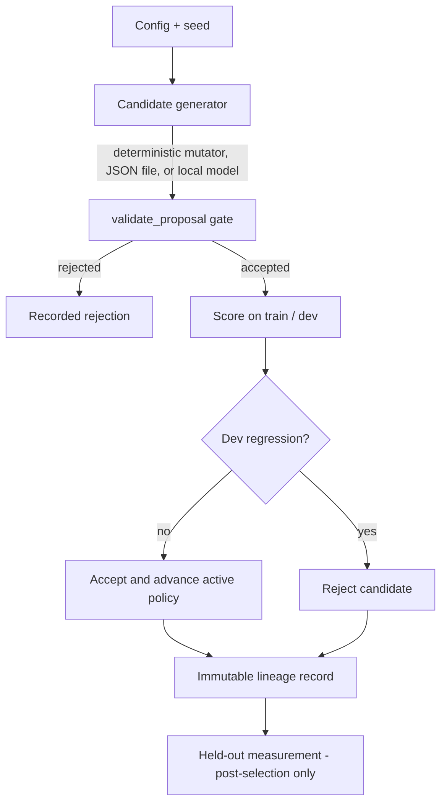

<p align="center">
  <h1 align="center">RSI Experimental Framework</h1>
  <p align="center">
    Controlled infrastructure for studying iterative, model-guided candidate
    generation, evaluation, and selection — with deterministic accounting.
  </p>
</p>

<p align="center">
  <a href="https://github.com/rustfuture/rsi-experimental-framework/actions/workflows/ci.yml"></a>
  
  <a href="LICENSE"></a>
  <a href="https://colab.research.google.com/github/rustfuture/rsi-experimental-framework/blob/main/notebooks/rsi_open_weight_colab.ipynb"></a>
</p>

<p align="center">
  <a href="#at-a-glance">At a Glance</a> ·
  <a href="#experiment-status">Status</a> ·
  <a href="#how-the-loop-works">Loop</a> ·
  <a href="#quick-start">Quick Start</a> ·
  <a href="#measured-results">Results</a> ·
  <a href="#limitations">Limitations</a>
</p>

<p align="center"><em>Open-weight experiment notebook (optional GPU path)</em></p>

This repository is the experimental accounting and verification substrate for one
question:

> Can a fixed base model improve held-out task performance through iterative
> candidate generation, evaluation, and selection?

It provides a deterministic harness baseline, an injectable and validated provider
boundary, immutable candidate lineage, strict held-out isolation, and committed,
re-derivable artifacts. It does not claim that any of this produces intelligence.

## At a Glance

| | |
|---|---|
| Language | Python 3.10+; deterministic path needs only the standard library |
| Experiment | Keyword-policy search over a fixed 32-sentence synthetic pool |
| Candidate gate | `validate_proposal` (single edit, vocabulary, polarity, bias bound) |
| Providers | Deterministic mutator (default), JSON proposals, optional local Transformers |
| Reproducibility | Canonical artifacts are byte-identical; CI re-runs and compares |
| Tests | 35 unit tests (CI on Python 3.11) |

## Experiment Status

| Capability | Status |
|---|---|
| Deterministic harness | Validated |
| Candidate lineage | Implemented |
| Held-out isolation | Tested |
| Local open-weight provider | Implemented |
| Real-model RSI evidence | Not yet recorded |

## How the Loop Works



The held-out split is never passed to candidate generation, scoring, or selection.
Only the final accepted policy is measured against it.

## Quick Start

The deterministic harness needs no third-party dependencies.

```bash
git clone https://github.com/rustfuture/rsi-experimental-framework.git
cd rsi-experimental-framework

# Full test suite: harness mechanics, lineage, provenance, reporting
python3 -m unittest discover -s tests -v

# Single deterministic run; render report.md from the artifacts
python3 -m rsi_framework --config config/default.json --output /tmp/rsi-run

# Bit-for-bit reproducibility of the deterministic artifacts
python3 -m rsi_framework --config config/default.json --output /tmp/rsi-replay
cmp results/first_run.json /tmp/rsi-replay/first_run.json

# Verify report.md and the README results block against the committed artifacts
python3 -m rsi_framework.reporting --results results --readme README.md --check
```

Prefer a zero-setup walkthrough? Open
[`notebooks/rsi_open_weight_colab.ipynb`](notebooks/rsi_open_weight_colab.ipynb) in
Colab. Its default path is CPU-safe (deterministic harness); the local open-weight
provider path is optional and requires a GPU runtime.

## Measured Results

> The block below is generated from `results/*.json` by
> `python -m rsi_framework.reporting --results results --readme README.md --update`.
> A regression test (`test_report_numbers_match_artifacts`) fails if it drifts from
> the artifacts. Experiment version: `v2-token-match`; v1 archives live in
> [`results/archive-v1/`](results/archive-v1/) and must not be pooled with these numbers.

<!-- BEGIN GENERATED: empirical results (do not edit by hand) -->
### 1. Single Run (Seed 20260915)
- **Method label**: `HARNESS_BASELINE_NOT_LLM`; experiment version `v2-token-match`
- **Train accuracy**: 0.625 (10/16) -> 1.000 (16/16)
- **Dev accuracy**: 0.375 (3/8) -> 1.000 (8/8)
- **Held-out accuracy**: 0.375 (3/8) -> 1.000 (8/8)
- **Outcome**: `improvement` (4 accepted new changes, 5 accepted versions including the baseline, 0 rejected dev regressions)

### 2. Multi-Seed Replay (Seeds: 42, 1337, 2026)
- **N seeds**: 3; **held-out examples per run**: 8; **std**: sample standard deviation (`ddof=1`)
- **Train accuracy (final)**: 0.792 ± 0.361
- **Dev accuracy (final)**: 0.875 ± 0.216
- **Held-out accuracy (final)**: 0.875 ± 0.216
- **Held-out gain**: +0.292 ± 0.260
- **Rejected dev regressions**: 2.67 ± 4.62
- **Accepted versions including the baseline**: 3.67 ± 2.31
- **Accepted new changes (baseline excluded)**: 2.67 ± 2.31

All seeds re-shuffle the same 32-row synthetic pool; these are replays of one toy dataset, not independent real-world samples. `improvement` / `flat` / `regression` are operational decision labels, not significance results.

### 3. Ablations
| Variant | Held-out accuracy | Held-out gain | Accepted new | Outcome |
|---|---:|---:|---:|---|
| `baseline_full` | 1.000 | +0.625 | 4 | improvement |
| `ablation_no_mutation` | 0.375 | +0.000 | 0 | flat |
| `ablation_no_selection` | 1.000 | +0.625 | 4 | improvement |
| `ablation_no_rollback` | 1.000 | +0.625 | 4 | improvement |
| `ablation_random_selection` | 0.375 | +0.000 | 8 | flat |
<!-- END GENERATED: empirical results -->

All raw and machine-readable data live under [`results/`](results/):

| Artifact | Contents |
|---|---|
| [`results/first_run.json`](results/first_run.json) | Canonical single-run record (byte-reproducible) |
| [`results/history.jsonl`](results/history.jsonl) | Step-by-step search trajectory |
| [`results/metrics.csv`](results/metrics.csv) | Generation metrics |
| [`results/multi_seed_results.json`](results/multi_seed_results.json) | Multi-seed aggregates (embed runtime) |
| [`results/ablation_results.json`](results/ablation_results.json) | Ablation runs with mechanism descriptions |
| [`results/provenance.json`](results/provenance.json) | Source commit, config hash, dataset hash, command |
| [`results/report.md`](results/report.md) | Rendered human-readable summary |
| [`results/archive-v1/`](results/archive-v1/) | Superseded v1 artifacts, preserved verbatim |

## Optional Local Model Provider

Implementation status, stated precisely:

- **Implemented.** `LocalTransformersProvider` (`rsi_framework/providers.py`) loads
  `--model` with HuggingFace Transformers on a validated `--device`;
  `LLMMutationGenerator` turns its output into candidate policies; the CLI exposes
  `--provider llm`, `--model`, and `--device`.
- **No real-model RSI experiment has been run or recorded.** Every result on this
  page is the deterministic baseline (`HARNESS_BASELINE_NOT_LLM`). No intelligence
  improvement is claimed for the toy baseline or for the unrecorded provider path.

Every proposal from every provider still passes through the central
`validate_proposal` gate before scoring: no-ops, multi-element edits,
out-of-vocabulary or malformed keywords, keywords shared across polarities, and
out-of-bound bias are rejected.

```bash
# Requires torch and transformers in the active environment; the deterministic path does not.
python3 -m rsi_framework --provider llm --model Qwen/Qwen2.5-0.5B-Instruct --device auto
```

An unavailable runtime or requested device exits with
`EXPERIMENT_BLOCKED_BY_RUNTIME` instead of silently substituting another device.

## Reproducibility

CI runs the full unit suite, checks that `report.md` and the README generated block
match the committed artifacts, replays the deterministic artifacts byte-for-byte,
and re-runs the benchmarks comparing every number except `runtime_seconds`.

```bash
# Multi-seed evaluation and ablations, refreshing report.md + README block in place
python3 -m rsi_framework --run-all-benchmarks --output results --readme README.md

# Compare artifacts without touching the committed copies
python3 -m rsi_framework --config config/default.json --output /tmp/rsi-replay
python3 -m rsi_framework --run-all-benchmarks --output /tmp/rsi-benchmarks
```

## Limitations

- **Harness validation, not intelligence.** The loop validates search-state
  accounting, rejection mechanics, and split containment. It establishes no
  reasoning, emergence, or unbounded self-improvement.
- **`improvement` / `flat` / `regression` are operational labels.** They come from
  one held-out comparison under a fixed tolerance on one run — not significance,
  equivalence, or confidence intervals.
- **Tiny held-out split.** Each run measures 8 held-out examples; one example moves
  accuracy by 0.125.
- **Lexical synthetic data.** The 8-concept sentence pool is shared by every seed,
  so multi-seed runs replay one toy dataset rather than independent samples.
- **Provider boundary.** The optional local provider is implemented and validated,
  but no real-model experiment is recorded here.
- **No paid APIs.** No cloud LLM APIs are used or required.

See [`DESIGN.md`](DESIGN.md) for the hypotheses, mechanics, and literature citations.

## Repository Map

| Path | Contents |
|---|---|
| `rsi_framework/core.py` | Experiment loop, scoring, lineage, ablations |
| `rsi_framework/providers.py` | Provider boundary, validation gate, local provider |
| `rsi_framework/reporting.py` | Provenance, report rendering, README check |
| `rsi_framework/cli.py` | `python -m rsi_framework` entry point |
| `tests/` | Core, provider-boundary, and device-resolution tests |
| `results/` | Committed deterministic artifacts |
| `notebooks/rsi_open_weight_colab.ipynb` | Optional GPU walkthrough |

## License

MIT — see [LICENSE](LICENSE).
