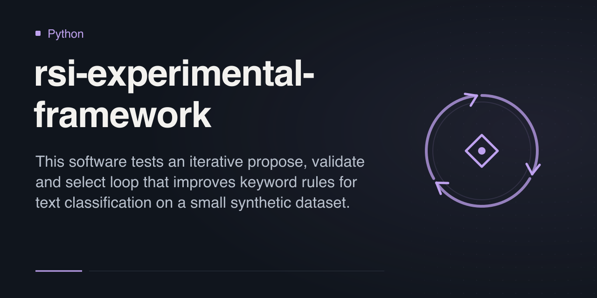

# RSI Experimental Framework



This software tests an iterative propose, validate and select loop that improves keyword rules for text classification on a small synthetic dataset.

RSI (recursive self-improvement) is the research question behind the name. This setup only edits keyword lists and makes no self-improvement claim.

[](https://github.com/rustfuture/rsi-experimental-framework/actions/workflows/ci.yml)
[](LICENSE)
[](https://colab.research.google.com/github/rustfuture/rsi-experimental-framework/blob/main/notebooks/rsi_open_weight_colab.ipynb)

> [!NOTE]
> **Status:** Research prototype; deterministic baseline validated, no real-model evidence yet.

- Generates, evaluates, and selects keyword-rule changes on synthetic text.
- Checks each proposed change against vocabulary, polarity, and bias rules.
- Rejects changes that reduce accuracy on development data.
- Scores held-out data only after selection ends (once for the baseline policy and once for the final policy).
- Writes reproducible run records and checked result summaries.

## Quick start

You need Git and Python 3.10+ ([Python downloads](https://www.python.org/downloads/)). The deterministic run uses only the Python standard library: no package installation, model weights, GPU, or API key is needed.

```bash
git clone https://github.com/rustfuture/rsi-experimental-framework.git
cd rsi-experimental-framework
python3 -m rsi_framework --config config/default.json --output /tmp/rsi-run
```

The command prints a JSON summary and writes run artifacts plus `report.md` to `/tmp/rsi-run`, leaving committed results unchanged. On Windows, use your Python 3 command (for example `py -3`) and a local output directory such as `runs/rsi-run` instead of `/tmp/rsi-run`.

For a guided notebook, open [`notebooks/rsi_open_weight_colab.ipynb`](notebooks/rsi_open_weight_colab.ipynb) in Colab. Its default path runs the deterministic harness; the optional local model path needs a GPU runtime.

## How it works

- It creates 32 synthetic sentences and divides them into train, development, and held-out groups.
- A generator proposes one-word keyword edits or small bias changes.
- A validation step rejects malformed edits, words outside the allowed vocabulary, polarity conflicts, and bias outside its allowed range.
- The framework scores candidates on the train and development groups, then rejects candidates that lower development accuracy.
- It records accepted candidates in an event history and checks the held-out group only after selection ends.

## Tests

CI runs these commands:

<details><summary>CI commands</summary>

```bash
python -m unittest discover -s tests -v
python -m rsi_framework.reporting --results results --readme README.md --check
python -m rsi_framework --config config/default.json --output /tmp/rsi-replay
for f in first_run.json history.jsonl metrics.csv progress.svg; do
  cmp "results/$f" "/tmp/rsi-replay/$f"
done
python -m rsi_framework --run-all-benchmarks --output /tmp/rsi-benchmarks
python - <<'PY'
import json, pathlib, sys

def strip(obj):
    if isinstance(obj, dict):
        return {k: strip(v) for k, v in obj.items() if k != "runtime_seconds"}
    if isinstance(obj, list):
        return [strip(v) for v in obj]
    return obj

failed = False
for name in ("multi_seed_results.json", "ablation_results.json"):
    committed = strip(json.loads(pathlib.Path("results", name).read_text()))
    replayed = strip(json.loads(pathlib.Path("/tmp/rsi-benchmarks", name).read_text()))
    if committed != replayed:
        failed = True
        print(f"MISMATCH: {name}", file=sys.stderr)
sys.exit(1 if failed else 0)
PY
```

</details>

The tests cover experiment mechanics, reporting, byte-for-byte output replay, and benchmark results apart from runtime duration.

## Experiment Status

| Capability | Status |
|---|---|
| Deterministic harness | Validated |
| Candidate lineage | Implemented |
| Held-out isolation | Tested |
| Local open-weight provider | Implemented |
| Real-model RSI evidence | Not yet recorded |

## Measured Results

> This block is generated from `results/*.json` by
> `python -m rsi_framework.reporting --results results --readme README.md --update`.
> A regression test (`test_report_numbers_match_artifacts`) fails if it drifts from
> the artifacts. Experiment version: `v2-token-match`; v1 archives live in
> [`results/archive-v1/`](results/archive-v1/) and must not be pooled with these numbers.

<!-- BEGIN GENERATED: empirical results (do not edit by hand) -->
### 1. Single Run (Seed 20260915)
- **Method label**: `HARNESS_BASELINE_NOT_LLM`; experiment version `v2-token-match`
- **Train accuracy**: 0.625 (10/16) -> 1.000 (16/16)
- **Dev accuracy**: 0.375 (3/8) -> 1.000 (8/8)
- **Held-out accuracy**: 0.375 (3/8) -> 1.000 (8/8)
- **Outcome**: `improvement` (4 accepted new changes, 5 accepted versions including the baseline, 0 rejected dev regressions)

### 2. Multi-Seed Replay (Seeds: 42, 1337, 2026)
- **N seeds**: 3; **held-out examples per run**: 8; **std**: sample standard deviation (`ddof=1`)
- **Train accuracy (final)**: 0.792 ± 0.361
- **Dev accuracy (final)**: 0.875 ± 0.216
- **Held-out accuracy (final)**: 0.875 ± 0.216
- **Held-out gain**: +0.292 ± 0.260
- **Rejected dev regressions**: 2.67 ± 4.62
- **Accepted versions including the baseline**: 3.67 ± 2.31
- **Accepted new changes (baseline excluded)**: 2.67 ± 2.31

All seeds re-shuffle the same 32-row synthetic pool; these are replays of one toy dataset, not independent real-world samples. `improvement` / `flat` / `regression` are operational decision labels, not significance results.

### 3. Ablations
| Variant | Held-out accuracy | Held-out gain | Accepted new | Outcome |
|---|---:|---:|---:|---|
| `baseline_full` | 1.000 | +0.625 | 4 | improvement |
| `ablation_no_mutation` | 0.375 | +0.000 | 0 | flat |
| `ablation_no_selection` | 1.000 | +0.625 | 4 | improvement |
| `ablation_no_rollback` | 1.000 | +0.625 | 4 | improvement |
| `ablation_random_selection` | 0.375 | +0.000 | 8 | flat |
<!-- END GENERATED: empirical results -->

The raw records and generation logs are indexed in [docs/reference.md](docs/reference.md), including [`results/first_run.json`](results/first_run.json), [`results/history.jsonl`](results/history.jsonl), [`results/metrics.csv`](results/metrics.csv), [`results/multi_seed_results.json`](results/multi_seed_results.json), [`results/ablation_results.json`](results/ablation_results.json), [`results/provenance.json`](results/provenance.json), and [`results/report.md`](results/report.md).

## Optional Local Model Provider

The code includes `LocalTransformersProvider` in `rsi_framework/providers.py`. It runs an open Hugging Face language model locally to propose keyword rules, using `--provider llm`, `--model`, and `--device`.

No experiment with a real model has been run or recorded. All results above come from the deterministic baseline (`HARNESS_BASELINE_NOT_LLM`). Proposals still pass through `validate_proposal`; an unavailable requested device stops the run with `EXPERIMENT_BLOCKED_BY_RUNTIME`.

```bash
# Requires torch and transformers in the active environment
python3 -m rsi_framework --provider llm --model Qwen/Qwen2.5-0.5B-Instruct --device auto
```

## Limitations

- The harness checks experiment bookkeeping, not machine intelligence, reasoning, or open-ended self-improvement.
- The outcome labels (`improvement`, `flat`, `regression`) describe one held-out comparison; they do not show statistical significance.
- Each run measures 8 held-out examples; one example changes accuracy by 0.125.
- Every seed uses the same 32-sentence synthetic pool, so the runs are replays of one toy dataset.
- The local model provider is implemented, but no real-model experiment has been recorded.
- The framework uses no cloud models or paid services.

See [`DESIGN.md`](DESIGN.md) for the hypotheses, experiment details, and literature citations.

## License

MIT — see [LICENSE](LICENSE).
